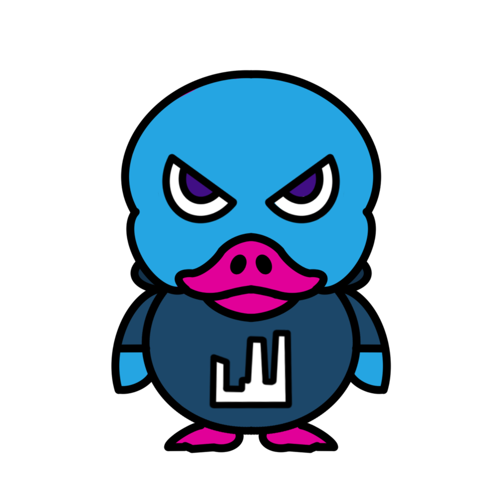

# La Manu BDE LH

## Description

Projet La Manu LH Dev & Designers - Designer un site web pour un BDE en 2 jours

## Fonctionnalités

* Page d'accueil
* Page Présentation BDE
* événements
* Contact
* Espace Adhérent
## Contributions

Si vous acceptez les contributions, expliquez comment les autres peuvent participer. Par exemple :

1. Forkez le dépôt
2. Créez une branche (`git checkout -b feature/nouvelle-fonctionnalite`)
3. Committez vos changements (`git commit -am 'Ajout d'une nouvelle fonctionnalité'`)
4. Poussez la branche (`git push origin feature/nouvelle-fonctionnalite`)
5. Créez une nouvelle Pull Request

## Licence

Indiquez la licence sous laquelle votre projet est distribué. Par exemple :

Ce projet est sous licence [MIT](./LICENCE).

## Auteur

La Manu - B1 & B2